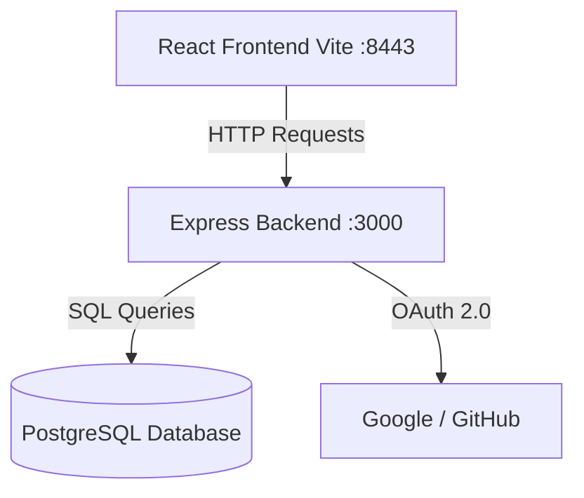

# KNODES - Project Context & Technical Architecture

## 1. System Architecture

The KNODES application uses a decoupled client-server architecture:
- **Client (Frontend)**: A Single Page Application (SPA) built with React and Vite. It manages state globally via React Context (`AppContext.tsx`) and handles UI rendering, routing, and user interactions.
- **Server (Backend API)**: A RESTful API built with Node.js and Express. It acts as the gateway between the frontend and the PostgreSQL database.
- **Database**: PostgreSQL handles persistent storage for Users, Auth Tokens, and Notes.



## 2. Directory Structure

```text
c:\second_brain\
├── app.js                   # Express application entry point (Mounts routes, middleware)
├── migrate.js               # Database schema migration script
├── package.json             # Backend dependencies and scripts
├── .env                     # Environment variables (DB URLs, API Keys, Secrets)
│
├── database/                # Database configurations
│   ├── db.js                # PostgreSQL connection pool configuration
│   └── schema.sql           # Core database schema definitions
│
├── middleware/              # Express middlewares
│   └── auth.js              # JWT verification middleware to protect private routes
│
├── routes/                  # Express route handlers (API endpoints)
│   ├── auth.js              # Local email/password authentication
│   ├── oauth.js             # Google & GitHub OAuth callbacks & token generation
│   ├── notes.js             # CRUD endpoints for user notes
│   └── users.js             # User profile endpoints (e.g., /me)
│
└── KNODES-main/             # Frontend React Application
    ├── index.html           # HTML template
    ├── package.json         # Frontend dependencies and scripts (Vite, React, Tailwind)
    ├── vite.config.ts       # Vite bundler configuration
    ├── src/                 
    │   ├── App.tsx          # Main React component and Router configuration
    │   ├── main.tsx         # React DOM mount point
    │   ├── context/         
    │   │   └── AppContext.tsx # Global state management & Backend API data hydration
    │   ├── components/      # Reusable UI components (Navbars, Cards, Icons)
    │   ├── data/            # Demo data placeholders
    │   ├── pages/           # Route-level components
    │   │   ├── AuthPage.tsx             # Login/Signup UI
    │   │   ├── AuthCallbackPage.tsx     # OAuth callback handler & Token persistor
    │   │   ├── BrainPage.tsx            # Knowledge Graph UI
    │   │   ├── NotesPage.tsx            # Note taking & management UI
    │   │   └── ProfilePage.tsx          # User profile settings UI
    │   └── types/           
    │       └── index.ts     # TypeScript interfaces (Note, User, GraphNode, etc.)
```

## 3. Database Schema

The system relies on three core tables in PostgreSQL:

### `learners` (Users)
- `id`: `INTEGER SERIAL PRIMARY KEY`
- `email`: `VARCHAR UNIQUE`
- `password_hash`: `VARCHAR` (Stores bcrypt hashed password or random string for OAuth users)
- `name`: `VARCHAR` (Display name from OAuth providers or local signup)
- `role`, `preferred_language`, `portal_optin`, `created_at`

### `refresh_tokens`
- `id`: `INTEGER SERIAL PRIMARY KEY`
- `learner_id`: `INTEGER` (Foreign key to `learners.id` `ON DELETE CASCADE`)
- `token`: `VARCHAR UNIQUE`
- `expires_at`: `TIMESTAMP`

### `notes`
- `id`: `UUID PRIMARY KEY` (Default `gen_random_uuid()`)
- `learner_id`: `INTEGER` (Foreign key to `learners.id` `ON DELETE CASCADE`)
- `title`: `TEXT`
- `body`: `TEXT`
- `status`: `VARCHAR` (draft, processing, completed, partial, failed)
- `concepts`: `JSONB` (Array of concepts extracted from the note)
- `created_at`, `updated_at`: `TIMESTAMP`

## 4. Authentication Flow
The application utilizes a stateless JWT token architecture supplemented by long-lived refresh tokens stored in the database.

1. **OAuth Flow**: 
   - User clicks Google/GitHub in React (`/api/oauth/google`).
   - Express redirects user to Provider.
   - Provider redirects back to `/api/oauth/google/callback` with a `code`.
   - Express exchanges `code` for access tokens, fetches user profile, creates/updates the `learners` record, generates internal JWTs, and redirects to React's `/auth-callback?accessToken=...&refreshToken=...`.
   - `AuthCallbackPage.tsx` extracts tokens from URL, saves to `localStorage`, and updates Context state to logged in.

2. **Standard API Requests**:
   - `AppContext.tsx` attaches `Authorization: Bearer <accessToken>` to headers.
   - `middleware/auth.js` verifies the JWT signature and extracts the `req.user.id`.

## 5. State Management & Hydration
React Context (`AppContext.tsx`) is the heart of the frontend.
- When `isLoggedIn` becomes true, `useEffect` hooks trigger `fetch()` calls to `/api/users/me` and `/api/notes`.
- The data is saved into the context state (`user`, `notes`), causing the UI components (`ProfilePage`, `NotesPage`) to re-render with live backend data.
- UI Mutations (like `addNote`) perform Optimistic UI updates (updating React state instantly) while simultaneously firing background POST/PUT requests to the Express API to persist changes.

## 6. Future Expansion
A FastAPI (Python) service is planned for integration. It will handle intensive NLP processing, taking Markdown notes from the PostgreSQL database, extracting concepts, identifying claims and prerequisites, and generating structured graph node data for the Brain visualization page.
